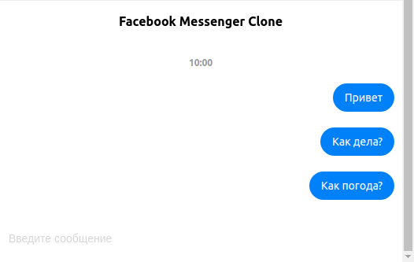

# prooftechit-react-test-assignment

### Тестовое задание на позицию React-разработчика

Требуется разработать упрощенный клон Facebook Messenger. Приложение — чат с аутентификацией. Отправить сообщение могут только аутентифицированные пользователи.

#### Бизнес-требования:

 - Приложение состоит из заголовка, области сообщений и поля для отправки
 - Каждые 10 сообщений разделяются текущем временем
 - В области отправки сообщений отправка осуществляется при нажатии Enter
 
#### Требования к технологиям:

 - Верстка должна быть выполнена с использованием Material UI (https://material-ui.com/ru/)
 - React Hooks
 - Для реализации аутентификации и обмена сообщениями следует использовать Firebase (https://firebase.google.com/). Аутентификацию осуществлять через GitHub-аккаунт
 - Запрещается использовать Create React App (CRA)
