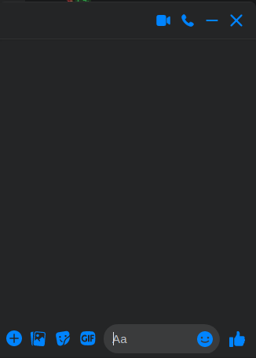

# prooftechit-react-test-assignment

### Тестовое задание на позицию React-разработчика

Требуется разработать упрощеный клон Facebook Messenger. Приложение должно представлять из себя echo-чат. При отправке сообщения все копии приложения получают отправляемое сообщение.

Требования к технологиям:

 - Верстка должна быть выполнена по макету, представленному на рисунке (иконки могут отличаться и быть заменены на похожие)
 - Использование React Hooks
 - Использование препроцессоров или CSS-In-JS
 - Для реализации обмена сообщениями следует использовать простой сервер на Node.js
 - **Запрещается** использвать Create React App (CRA)
